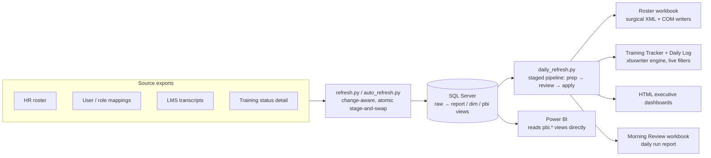

# Training Rollout Analytics Toolkit

**A single-analyst analytics operation, fully automated:** a SQL Server
reporting warehouse, a staged daily-refresh pipeline, and self-building Excel
workbooks and HTML dashboards for tracking a large workforce training rollout
(thousands of learners, dozens of classes, a hard go-live date).

Originally built for a healthcare revenue-cycle Epic training program and
sanitized into a reusable template. Everything here runs on plain Python +
SQL Server Express + Excel — no BI licenses, no macros, no servers.

## Architecture

## Highlights

- **`scripts/daily_refresh.py`** — pipeline orchestrator: staged steps with
  `--from/--only/--skip`, a run lock, per-step runlogs, guard checks (files
  closed, prep ran today), and automatic pre-change backups.
- **`scripts/build_rcm_training_tracker.py`** — a ~2,400-line Excel report
  engine. Builds a multi-sheet tracker with **live leader filtering and no
  macros**: dropdown cells drive dynamic-array `FILTER`/`SORT` formulas over
  hidden data blocks. Builds locally, QAs itself against an independent SQL
  scorecard, then publishes one atomic copy to the synced folder.
- **`scripts/surgical_xlsx.py`** — edits xlsx XML directly inside the zip
  container, preserving features that openpyxl round-trips destroy
  (Power Query, dynamic arrays, x14 validations).
- **`sql/refresh.py` + `sql/auto_refresh.py`** — warehouse loaders: only
  reload sources whose files changed, load into a staging table and swap, and
  snapshot a daily roster history for change tracking.
- **`scripts/person_history.py`** — one command answers "what changed for
  this person?" across every history source: monthly snapshots, daily SQL
  diffs, change-request forms, LMS transcripts.
- **`sql/tools/qa_views.py`** — an assertion suite over the report views;
  run after every schema change.
- **`docs/`** — the real operating runbooks (sanitized): the daily refresh
  procedure and the warehouse guide.

## Repository map

| Area | Files | What they do |
|---|---|---|
| Pipeline | `daily_refresh.py`, `backup_deliverables.py`, `master_backup.py`, `runlog.py`, `activity_log.py`, `source_freshness.py` | Orchestration, backups, run logging, freshness checks |
| Warehouse | `sql/refresh.py`, `sql/auto_refresh.py`, `sql/1_setup.sql`, `sql/3_report_views.sql`, `sql/4_dimensions.sql`, `sql/5_sandbox.sql`, `sql/build_data_dictionary.py`, `sql/query.py` | Loads, view definitions, self-documenting catalog, ad-hoc pulls |
| Roster updaters | `update_master_from_mvp.py`, `update_master_from_hr_safe.py`, `add_missing_to_master.py`, `review_hr_leader_changes.py`, `clean_hr.py` | Preview-then-apply updates to the source-of-truth workbook |
| Report builders | `build_rcm_training_tracker.py`, `build_morning_review.py`, `build_team_wave_file.py`, `build_metrics_summary.py`, `wave_job_role_change_report.py`, `export_boss_reports.py`, `missing_from_wave_hr.py` | Excel deliverables, all generated from SQL |
| Dashboards | `w3_exec_brief.py`, `w3_dashboard.py`, `w3_scorecard.py` | Generated HTML executive dashboards + console scorecard |
| Tools | `person_history.py`, `csi_tracker.py` (PDF → rolling tracker), `restore_power_query.py`, `build_reference_lists.py` | Investigation and maintenance utilities |
| Shared libs | `onedrive_paths.py`, `leader_names.py`, `surgical_xlsx.py`, `report_xlsx.py` | Central paths, name normalization, xlsx engines |

## This is a template — fill in the placeholders

All org-specific values were replaced by an automated sanitizer (with a
verification sweep) before publishing. Search and replace:

| Placeholder | Meaning |
|---|---|
| `YourOrg` / `YOURORG` / `yourorg` | Organization name |
| `YourUser` | Windows username |
| `C:\path\to\analytics` | Local repo root (scripts + venv) |
| `C:\path\to\shared\workspace` | Shared/synced data root |
| `AnalyticsDB` | SQL Server database name |
| `Lastname01, Firstname01` … `16` | Your leader allowlist (`scripts/leader_names.py`) |
| Other `*last`/`*first` tokens | People in alias maps/comments — replace or delete |
| `you@example.com` | Your email |

**Start here:** `scripts/onedrive_paths.py` (every path flows through it),
then `scripts/leader_names.py` (leader list + name normalization), then run
`sql/1_setup.sql` and `sql/refresh.py`.

## Requirements

Python 3.12+, SQL Server (Express works), Excel. Python packages in
[requirements.txt](requirements.txt). `xlwings`/`pywin32` are only needed by
the scripts that edit a live workbook through Excel itself.

## Design principles

- **Preview, then apply** — every workbook-writing step has a dry-run that
  exports a change list for human review first.
- **Atomic everywhere** — SQL loads stage-and-swap; workbooks build in local
  staging and publish as one copy; a partial write never lands on a synced
  path.
- **Backups before every change** — daily dated copies with a documented
  revert path, kept in dedicated backup folders.
- **SQL is the report logic** — Python renders; views compute. Every view
  header doubles as its data-dictionary entry.
- **No black boxes** — live Excel filtering via native dynamic arrays instead
  of macros/VBA; HTML dashboards are dependency-free generated files.

## License

MIT — see [LICENSE](LICENSE).
